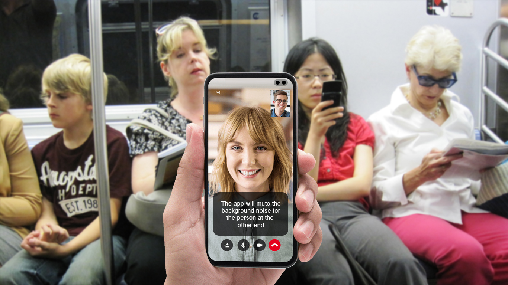
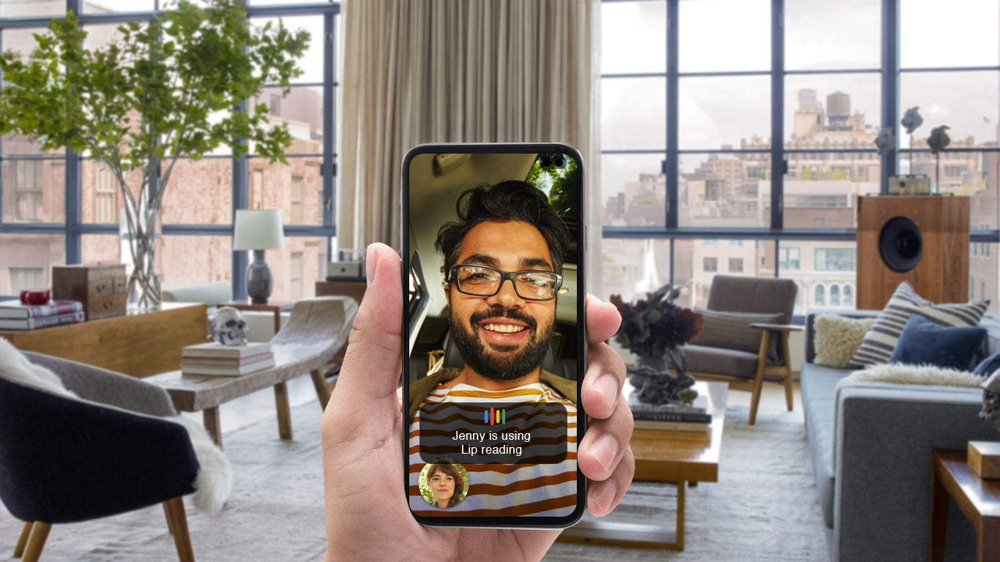
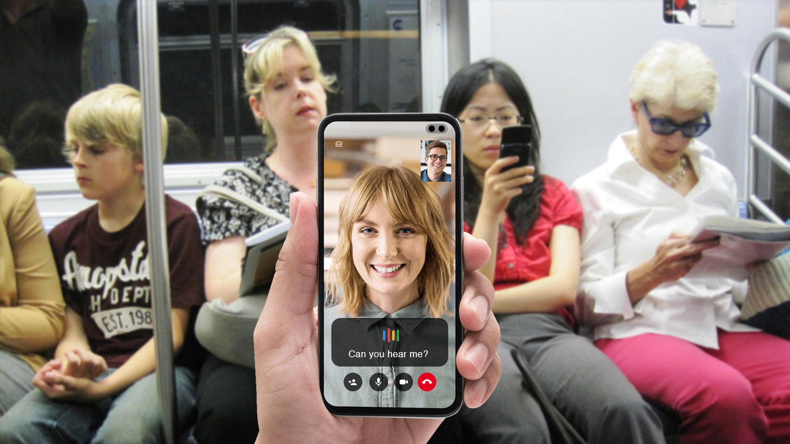
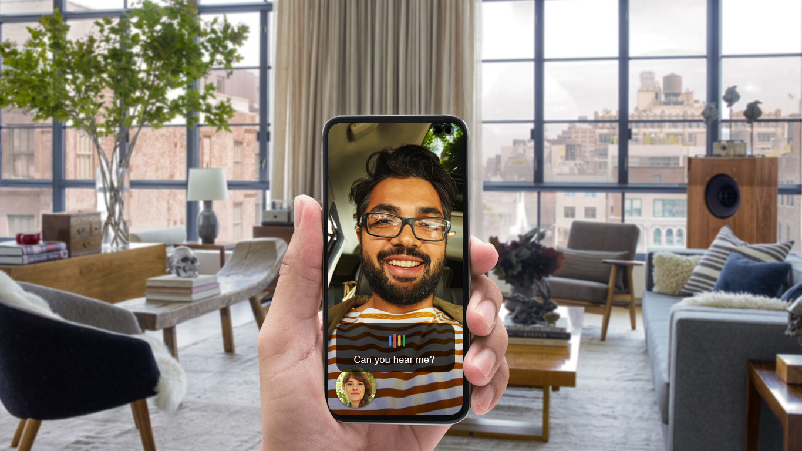

# Lip Reading on Video call

A lip reading app for Video calls which will help when there is background noise. The app will read your lips and translate it to text or voice to the person at the other end. 

## App Flow

***Step 1: Open the video call app and tap on Lip read***

***Step 2: The app will mute your background noise for the person at the other end.***

***step 3: Will start lip reading and show the text in the bottom for you***

***Step 4: The person at the other end can hear your simulated voice with clarity***

# Tell us how you plan on bringing it to life.

The app is in a concept stage right now, we would like to use lip reading to recognise the speech and translate it to text or speech at the other end, to do this we would like to use on device ML to do the processing and show the results in real time.

# Tell us about you

We are a software company called [Flashbox](http://flashbox.in/)  in Bengaluru, India helping large enterprises build products. We also are developing an app called [5Things](https://play.google.com/store/apps/details?id=com.flashbox.a5things) which shows you content (News, Restaurants, movies, weather, sports scores, stock market updates, trivia etc based on demography and location). At a time we show only 5Things. Right now we are in beta, we will be releasing the app within couple months.
